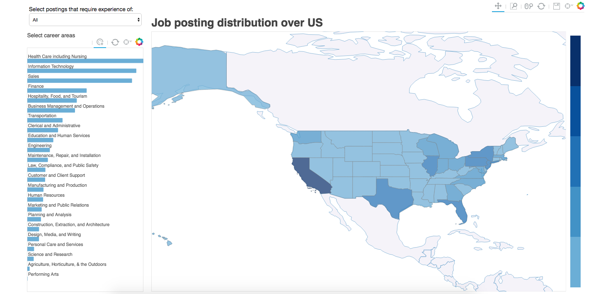

# bokeh-map-visualization
This is how I implement bokeh module to draw a map visualization with filters in Python.

Sample screen shot as following:

The leftabove filter controls the bar plot and map plot. Each career area can be selected in the bar plot, its corresponding job posting count data will be shown on the map. And when multiple areas are selected, the map shows the accumulated data in each state. 

State name, count data and geo-coordinates can be found when hover over the map (countries except US will not show count data.) 

Deepest blue means the state is among the top 20% postings of all states. And the lightest blue shows the reversely.
